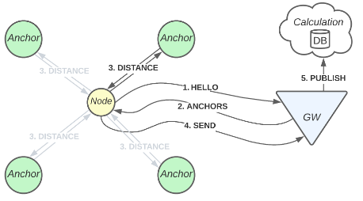

# Localization on LoRa 2.4GHz

The SX1280 transceiver made by Semtech uses the 2.4 GHz band to provide long range communication. The chipset also integrates time-of-flight functionality, allowing for ranging. Because of the low power consumption, the chipset can be integrated into small and battery-powered devices.
The radio operates in the ISM band, an unlicensed band, which means that users do not need a license and there are no restrictions on its use. Another great advantage is the global interoperation that this band provides.

But why would we use LoRa for localization (apart from Semtech’s marketing)? The greatest disadvantage of any GNSS system is the fact that an open sky is needed. Therefore, the warehouse industry is investing in other localization systems. The cost could also be an important factor. As shown in Table 1, a GNSS module would be almost five times the price of a LoRa transceiver. Another reason could be the power consumption; the power consumption of a LoRa transceiver and a GNSS-receiver would be around the same value, but a communication layer would be needed to propagate the GNSS data.
More recent localization techniques like Wi-Fi or BLE could be compared. These technologies have a lower range, meaning there are more anchors needed in comparison to LoRa. A case study has been done by Danalto comparing both technologies, switching technologies in an environment would reduce complexity and cost.

To evaluate the new chipsets by Semtech, we made a multi-node localization framework. This framework can be used as-is, but because of our modular design, every module can be interchanged to improve the overall performance.

## Overview

As shown in Figure 1, in our design there are 3 roles in the network: *Gateway*, *Anchors* and *Nodes*.

- The *Gateway* publishes the LoRa packets to a server for further processing.
- The *Anchors* are fixed and have a cartesian coordinate saved in the database.
- The *Nodes* are mobile, and their location must be determined.

Figure 1: A high-level overview of the architecture

The following procedure is used:

1. A new *Node* joins the network and contacts the *Gateway* for information about the network.
2. The *Gateway* answers with the *Anchors* that should be on the network for ranging.
3. The *Node* stores this information in volatile memory.
4. The *Node* will do a ranging operation on the first *Anchor*
    1. If the *Anchor* answers, the response holding multiple distances is sent to the gateway
    2. If the *Anchor* does not answer, no response is sent.
5. The *Gateway* publishes this response on the Redis instance, including information about the *Anchor* and the *Node*.
6. A Python-based listener bundles the data and calculates the location.
7. The calculated location is stored on a persistent PostgreSQL database (Supabase).

## Folder Structure

- **hardware**: The Arduino code for the Anchor, mobile Node, Gateway (Wi-Fi connected)
- **ranging_fix:** C function that needs to be added to the SX12XX-LoRa library
- **sw_frontend_client:** Svelte project to visualize the localization
- **sw_backend_server:** Redis + Python Docker container to calculate the localization
- **plotting_data:** A small python script to plot location data from a CSV to a map. It includes a comparison algorithm.
- **documentation**: All relevant documentation for this project

## External Dependencies

- **SX12XX-LoRa Library**: https://github.com/StuartsProjects/SX12XX-LoRa
- **Supabase (PostgreSQL)**:  Table layout can be found in folder *sw_backend_server/database-dump*
- **Localization**: https://github.com/kamalshadi/Localization

May 2022
– Louis de Looze