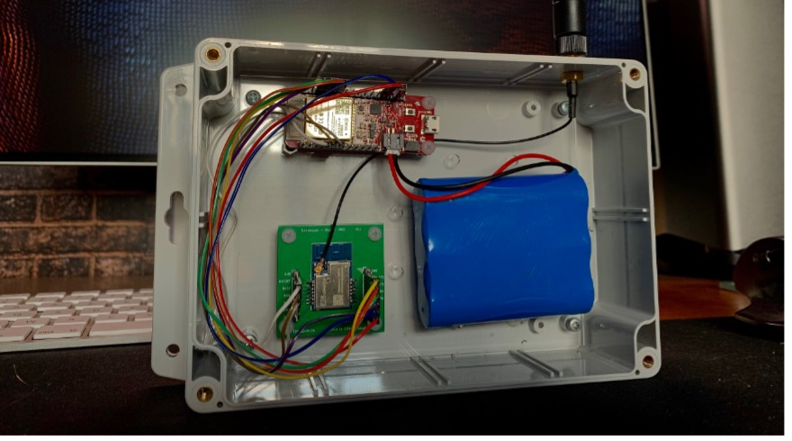

# Hardware

- The *Gateway* publishes the LoRa packets to a server for further processing.
- The *Anchors* are fixed and have a cartesian coordinate saved in the database.
- The *Nodes* are mobile, and their location must be determined.

## Hardware used

The hardware was provided by the University of Antwerp and each box consists of an ESP32 and an Ebyte E28 (SX1280) visible in Figure 2. These components are enclosed in a sealed container with an internal battery for a full wireless deployment.

Figure 1: The internals of a LoRa chipset + microcontroller box

The library we used to communicate with the SX1280 chipsets is built and maintained by Stuart Robinson. It is designed to work with the Arduino IDE and is (mostly) compatible with the ESP32 but is originally programmed for Atmel microcontrollers.

[https://github.com/StuartsProjects/SX12XX-LoRa](https://github.com/StuartsProjects/SX12XX-LoRa)

## How to use

1. Install the SX12XX-LoRa library.
2. Add the fix from *ranging_fix.md.*
3. Configure the parameters.
4. Flash a project onto the ESP32 (or another controller).

## Parameters

The following parameters can be changed without any problem:

- Radio settings → Have to be the same on every device
- Pin definitions of the chipset

### Gateway

In the settings.h fill in:

- Redis URL and password
- Wi-Fi SSID and password

### Anchors

- Set the correct RangingID → **Needs to be unique!**

### Node

- Set the correct RangingID → **Needs to be unique!**

## Improvements

### Gateway

- Get online anchors with a GET request from the database on boot.

### Anchors

- Add debug flag to Serial.
- Add the possibility to change parameters on the fly.
- Add the possibility to set ranging calibration.

### Node

- Make the system allow more than 4 online anchors -> Allocate space during runtime
- Make the polling rate variable based on distance difference.
- Add the possibility to send other telemetry data to the gateway.
- Add a timeout for a not answering anchor. That it will only contact it again after a cooldown period.

**Note**: This is a non-exhaustive list, feel free to improve or adapt this code!

May 2022
– Louis de Looze