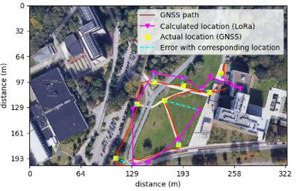

# Plotting data

This is a small helper script that plots the exported data in Python. It is possible to add a second set of points and find the average error between them.



This code has not been tested extensively, but works for my application.

## Parameters

- **factor**: This is the factor px/m map1 has 15.5244 and map2 has 45.16
- **analysis**: True if you provide a second csv to compare points with
- **data_from_db_export**: True if the data is in json
- **map_img**: A picture of the map that is used as the background
- **calculated_data_csv**: The main calculated csv
- **compare_data_csv**: The csv of the points that have been compared with

## Test data

Test data is provided and can be found in the folder *example-data.*

## Requirements
Can be installed with the following command:
```bash
pip install -r requirements.txt
```

May 2022
– Louis de Looze