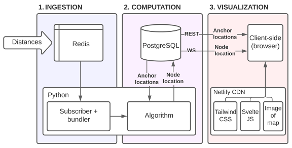
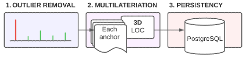

# Software

Our goal is to create a framework where each module can be interchanged without designing a completely new system. This section will be an overview of every module that is needed to provide the whole localization service. As shown in Figure 1, the system is split into three parts.



Figure 1: Overview of the software stack.

## Data Ingestion

The Data Ingestion system is based on Redis. It is an in-memory storage system with a message broker. Another often used pub-sub protocol is Message Queuing Telemetry Transport (MQTT), but because of our prior knowledge of Redis, we chose this route. The Redis instance is deployed inside a Docker container that can be deployed locally or in a Virtual Private Server (VPS). During testing, we used a Digital Ocean Droplet for deployment.

The *Gateway* will “publish” the distance readings on the Redis Instance, there they will not be stored. Only the currently subscribed listeners will be able to capture the messages. Alongside Redis, there is a Python script “subscribing” and allowing it to compute the captured messages.

## Data Computation

When there is a desire to improve the localization results, this is the module where a lot can be done. Right now, there is a pure mathematical multilateration algorithm that calculates the location based on the new data. The algorithm used is developed by Kamal Shadi .  Our goal was to create a framework for localization, tough in the future, ML-based algorithms could be used to improve the correctness of the results.

All the computation happens inside of a Python script. This stage is composed of three steps, visualised in Figure 2.



Figure 2: Overview of the data computation module

- **Outlier Removal**: A Standard Deviation outlier removal is being used to remove wrong results. The resulting distances will be averaged out to minimize errors.
- **Multilateration**: The data from each (in range) node is used to calculate a cartesian position.
- **Persistency**: The final position is saved inside the PostgreSQL database (Supabase [7]).

## Deploying

First make sure that you have a .env file! Make use of the .env.sample file.

Then run following commands in the *sw_backend_server* directory

```c
docker compose build
docker compose up -d
```

And you are done!

May 2022
– Louis de Looze